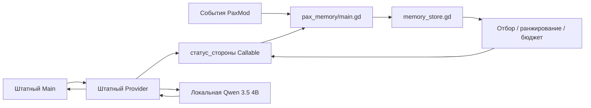

# Архитектура эксперимента

## Установленные факты

Контрольная установка содержит 415 файлов, 1 126 741 789 байт. Копия создана потоковым копированием содержимого и проверкой SHA-256, без hard links. Оригинал не редактируется. Экспериментальная игра расположена в `.local/refactor-game`; приватные измерения — в `.local/Pax Universe Refactor`.

Игра сообщает версию 0.15.1, движок — Godot 4.7.2 stable custom build. Метод версии модового загрузчика возвращает 0.13.2; это отдельное несовпадение версии, а не версия запущенной игры.

Публичная reflection-инспекция видит 3340 путей ресурсов и 131 игровой Script. Исходный текст у всех этих Script отсутствует. Заголовок PCK имеет формат 4 и флаги шифрования каталога; ключи не извлекались, защита не обходилась.

| Компонент | Методов | Свойств | Ссылок на Script в константах |
|---|---:|---:|---:|
| Main | 1012 | 421 | 93 |
| Меню | 119 | 56 | 15 |
| Фракции | 110 | 11 | 8 |
| Provider | 76 | 50 | 9 |
| PaxGame | 43 | 4 | — |

Это счётчики метаданных, а не строки исходного кода, runtime call graph или доказательство затрат CPU. Размер Main показывает высокую концентрацию обязанностей; без исходников его внутренние алгоритмы не переписывались.

## Реально изменяемый участок

Адаптер делегирует оригинальному callback и добавляет ограниченный блок свидетельств. Формат ответа, сетевой клиент, применение приказов, баланс и мир остаются штатными. Нет покадрового обхода мира или дополнительного фонового запроса к модели. Собственные записи сохраняются через `_save_state` / `_game_loaded`.

## Десять зон для проверки, а не десять доказанных тормозов

1. Main: концентрация 1012 методов; настоящая декомпозиция требует исходников.
2. UI и симуляция связаны в Main; перенос бизнес-логики пока недоступен.
3. Provider: существующие каналы, память и бюджет следует расширять, сохраняя формат.
4. Callback контекста без аргументов: доступна область мира/игрока, но не текст запроса.
5. Ответ модели не равен факту: нужны источник, уверенность и защита от повторного исполнения приказов.
6. Сохранения: компоненты привязаны к слоту при создании Main; менять один `Main.слот` после запуска нельзя.
7. Моды: bootstrap должен писать `disabled: []`, а не `null`; ошибка тестового скрипта воспроизводила аварийный выход загрузчика.
8. Время: остановка автоигры и завершение открытого окна итогов — разные состояния, требующие корректной проверки.
9. Производительность: ограничение 30 FPS маскирует запас GPU; интервалы кадров не равны времени чистой симуляции.
10. Пространственные команды AI: проверять точные игровые идентификаторы и нативное применение отдельно от качества текста и синтетических координат.

Полная централизованная очередь всех AI-запросов, новая симуляция, декомпозиция Main и общая миграция формата игры здесь не реализованы. Пустые архитектурные заглушки для них не создаются.
